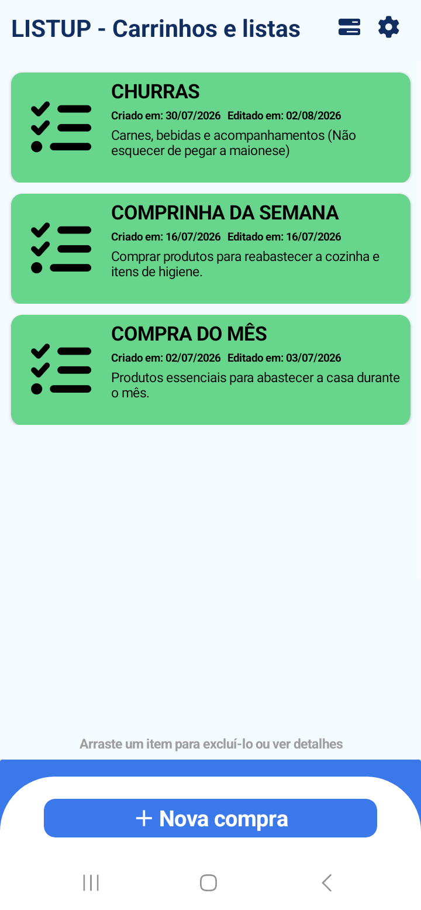
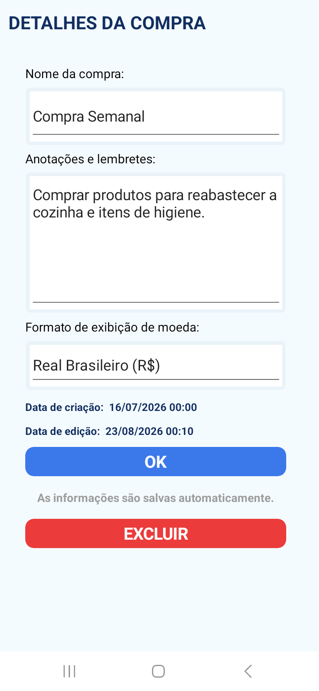
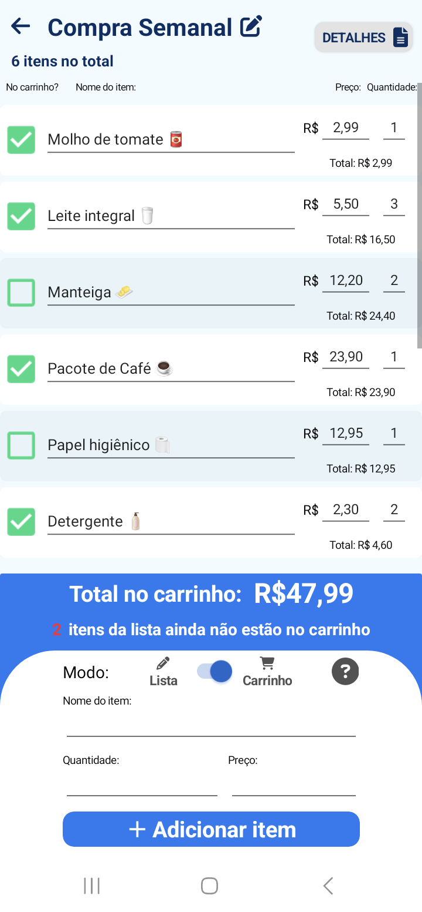

# Listup

O **Listup** é um aplicativo Android desenvolvido para facilitar a organização de compras de supermercado, permitindo planejar a compra tanto antes de ir ao mercado quanto acompanhá-la durante sua realização.

O aplicativo possui dois modos de utilização:

* **Modo Lista:** permite criar e organizar uma lista de compras, adicionando produtos e suas respectivas quantidades. A lista pode ser posteriormente convertida para o Modo Carrinho.
* **Modo Carrinho:** permite acompanhar a compra em tempo real, marcando os produtos conforme são adicionados ao carrinho e informando o preço unitário de cada item. O valor total da compra é calculado automaticamente com base na quantidade e no preço dos produtos.

Também é possível iniciar uma compra diretamente no Modo Carrinho, informando o preço dos produtos no momento em que eles são adicionados.

O aplicativo funciona **offline**, com os dados armazenados localmente no dispositivo.

## Screenshots

### Tela Inicial

### Tela de Detalhes

### Tela de Carrinho

## Tecnologias

* **Xamarin.Forms** — desenvolvimento da aplicação Android
* **C#** — linguagem de programação
* **SQLite** — persistência local dos dados
* **MVVM** — arquitetura utilizada para organização e separação das responsabilidades da aplicação
* **Visual Studio** — ambiente de desenvolvimento

## Licença

O **Listup** é disponibilizado como um projeto de código aberto. Seu código pode ser utilizado, modificado e redistribuído, desde que os devidos créditos ao autor e ao projeto original sejam devidamente mantidos.

**Desenvolvido por Juan Lucas Cardoso**
